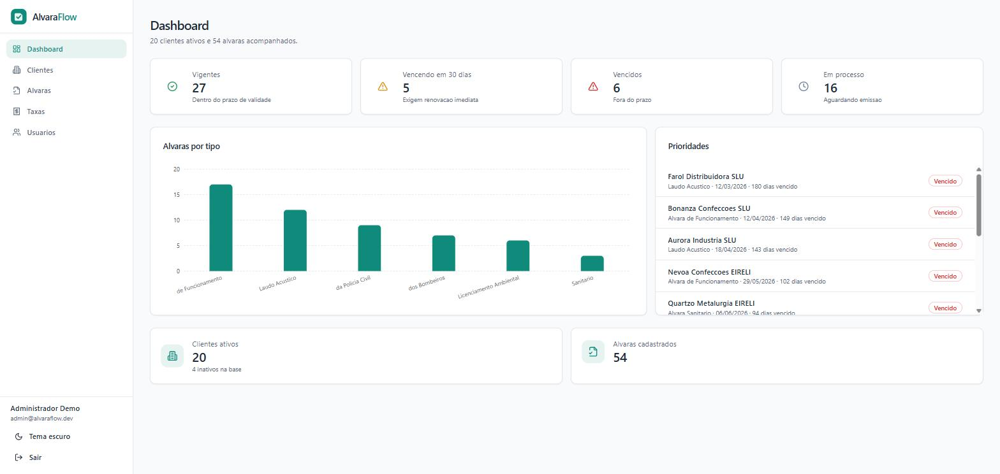
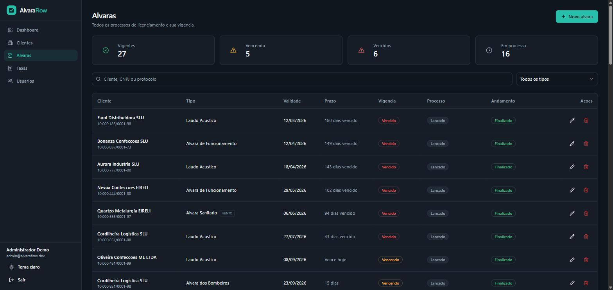
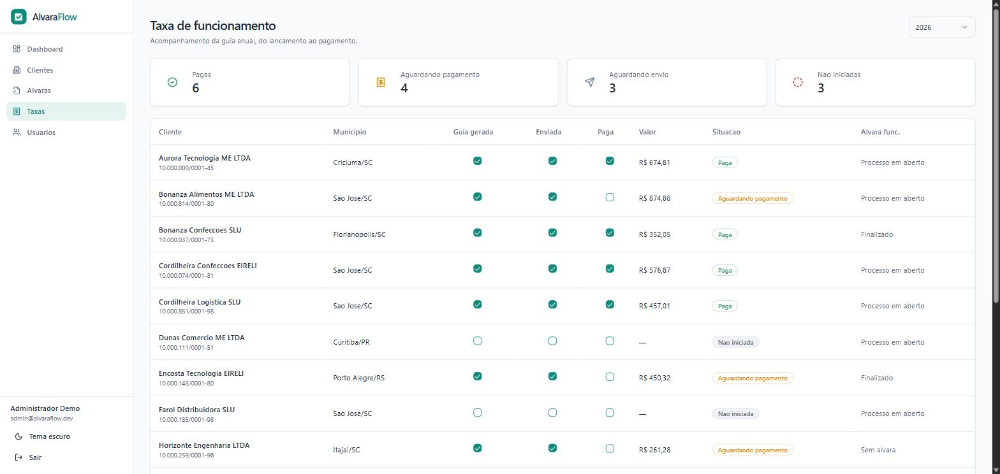

<div align="center">


# AlvaraFlow

**Controle de alvarás, licenças e taxas de funcionamento de empresas.**
O que normalmente vive numa planilha compartilhada, com prazo legal e multa do outro lado.


</div>

<p align="center">
  
</p>

> **Sobre os dados:** tudo o que aparece aqui é gerado pelo `seed`. As empresas não existem, os CNPJs são números sintéticos com dígito verificador calculado apenas para as validações passarem, e nenhum dado real de cliente foi usado ou está distribuído neste repositório.

---

## O problema

Alvará não é um documento só. Uma mesma empresa acumula alvará de funcionamento, bombeiros, sanitário, licenciamento ambiental, laudo acústico — cada um com órgão emissor, prazo de validade e ciclo de renovação próprios. Quem administra dezenas de empresas precisa saber, todo dia, o que está prestes a vencer. Perder a data significa multa ou interdição.

Na prática esse controle costuma virar uma planilha que ninguém confia: o status é digitado à mão e envelhece sozinho, o processo em andamento se mistura com o documento vigente, e a taxa anual some do radar de quem ainda não emitiu guia nenhuma.

O AlvaraFlow responde a três perguntas, que são as três telas principais:

| Pergunta | Como o sistema responde |
| --- | --- |
| **O que vence agora?** | Vigência calculada na leitura, com destaque para o que vence em até 30 dias |
| **Onde o processo travou?** | Andamento próprio do processo: aguardando cliente, aguardando órgão, protocolado, aguardando pagamento |
| **A taxa anual foi paga?** | Guia por cliente e por ano, em três etapas encadeadas |

## Telas

<table>
  <tr>
    <td width="50%">
      
      <p align="center"><sub><b>Alvarás</b> — ordenados por urgência, com vigência, processo e andamento em colunas separadas. Os cartões do topo filtram a lista.</sub></p>
    </td>
    <td width="50%">
      
      <p align="center"><sub><b>Taxa de funcionamento</b> — uma linha por cliente ativo do ano; marcar uma etapa adianta as anteriores.</sub></p>
    </td>
  </tr>
</table>

## Decisões de arquitetura

As escolhas que explicam o código:

- **Vigência é derivada, nunca gravada.** `pending` / `valid` / `expiring` / `expired` saem das datas de emissão e validade no momento da leitura ([`domain.ts`](apps/api/src/lib/domain.ts)). Persistir o status exigiria um job para envelhecer registros e garantiria que alguma linha ficasse errada entre uma execução e outra.
- **Duas dimensões de estado, não uma.** A vigência do documento e o andamento do processo são independentes: um alvará vigente pode estar em renovação, e um vencido pode estar protocolado. Colapsar os dois num campo só é o erro que a planilha comete.
- **Ordenação por urgência acontece na aplicação.** Um `ORDER BY expirationDate` no banco jogaria os nulos — validade indeterminada e processos em aberto — para o topo, exatamente onde deveria estar o que já venceu.
- **Datas comparadas em UTC.** Trafegam em ISO à meia-noite UTC e são formatadas pelos componentes UTC. Converter para o fuso local deslocaria o dia em qualquer fuso negativo, que é o caso do Brasil inteiro.
- **A tela de taxas parte do cliente, não da taxa.** Ela lista todo cliente ativo do ano e anexa a guia quando existe. Se partisse da tabela de taxas, quem nunca teve guia emitida sumiria da lista — justamente quem precisa aparecer.
- **Três booleanos, não um enum.** `gerada` / `enviada` / `paga` são etapas cumulativas; a situação exibida é derivada delas, do estágio mais avançado ao inicial.

## Stack

| Camada | Tecnologias |
| --- | --- |
| **API** | Node 20+, Express 4, TypeScript, Prisma 6 (SQLite), Zod, JWT, bcrypt, Multer |
| **Web** | React 18, TypeScript, Vite, TanStack Query, React Router, Tailwind CSS, shadcn/ui, Recharts |
| **Repo** | npm workspaces |

Sem Docker, sem banco para provisionar, sem chave de API, sem compilação nativa. O banco é um arquivo SQLite e os anexos vão para uma pasta local — a intenção é que qualquer pessoa clone e rode em dois comandos.

## Como rodar

Requisitos: **Node 20+** e **npm 10+**.

```bash
git clone https://github.com/<seu-usuario>/alvaraflow.git
cd alvaraflow

cp apps/api/.env.example apps/api/.env
# Windows (PowerShell): Copy-Item apps\api\.env.example apps\api\.env

npm run setup    # instala dependências, cria o banco e popula a demonstração
npm run dev      # API em :3333, front em :5173
```

Abra <http://localhost:5173>:

| Usuário | Senha | Perfil |
| --- | --- | --- |
| `admin@alvaraflow.dev` | `Demo@1234` | Administrador |
| `analista@alvaraflow.dev` | `Demo@1234` | Analista (sem a aba Usuários) |

A tela de login traz um botão que preenche as credenciais. Para voltar o banco ao estado inicial: `npm run db:reset`.

### Scripts

| Comando | O que faz |
| --- | --- |
| `npm run dev` | Sobe API e front juntos |
| `npm run build` | Compila os dois pacotes |
| `npm run typecheck` | Checagem de tipos em ambos |
| `npm run db:reset` | Recria o schema e roda o seed |
| `npm run db:studio -w @alvaraflow/api` | Prisma Studio para inspecionar o banco |

## Estrutura

```
apps/
  api/
    prisma/schema.prisma    modelo de dados
    prisma/seed.ts          gerador da base de demonstração
    src/lib/domain.ts       vocabulário do domínio e regra de vigência
    src/middleware/         auth (JWT), upload, tratamento central de erro
    src/modules/            auth · users · clientes · alvaras · taxas · documentos · dashboard
  web/
    src/lib/api.ts          cliente HTTP tipado
    src/lib/status.ts       rótulos e cores de cada estado
    src/components/         layout, badges, formulários
    src/pages/              Login · Dashboard · Clientes · Alvaras · Taxas · Usuarios
```

Todo módulo da API tem o mesmo formato: **`*.schema.ts`** valida a entrada com Zod na borda, **`*.repository.ts`** concentra consultas e serialização, **`*.routes.ts`** cuida do HTTP. Erros conhecidos — Zod, Multer, violação de unicidade do Prisma — viram resposta JSON estável no [handler central](apps/api/src/middleware/error-handler.ts), então nenhuma rota precisa de `try/catch`.

## API

Todas as rotas exigem `Authorization: Bearer <token>`, exceto `/api/health`, `/api/auth/login` e `/api/auth/register`.

| Método | Rota | Descrição |
| --- | --- | --- |
| `POST` | `/api/auth/login` | Autentica e devolve o JWT (10 tentativas / 15 min por IP) |
| `GET` | `/api/auth/me` | Usuário da sessão |
| `PUT` | `/api/auth/change-password` | Troca a própria senha |
| `GET` | `/api/clientes` | Lista com `busca`, `uf` e `situacao` |
| `POST` `PUT` `DELETE` | `/api/clientes/:id` | CRUD de clientes |
| `GET` | `/api/alvaras` | Lista com `busca`, `tipo`, `status`, `clienteId` |
| `POST` | `/api/alvaras/:id/finalizar` | Registra emissão e validade e encerra o andamento |
| `GET` | `/api/taxas?ano=2026` | Uma linha por cliente ativo, com resumo do ano |
| `PUT` | `/api/taxas` | Cria ou atualiza a guia do par (cliente, ano) |
| `POST` | `/api/documentos/upload` | Anexa arquivos a um cliente **ou** a um alvará |
| `GET` | `/api/dashboard` | Contadores, distribuição por tipo e prioridades |

## Segurança

O que está aplicado, na medida que um MVP comporta:

- Senhas com **bcrypt**; o hash nunca sai do servidor — `toPublicUser` monta a resposta campo a campo em vez de devolver a entidade.
- Login com **mensagem única** para e-mail inexistente e senha errada, para não revelar quais e-mails existem na base.
- **Rate limit** no login, `helmet` e CORS restrito por origem.
- **Validação Zod** em toda entrada, incluindo os dígitos verificadores do CNPJ.
- Upload com **allowlist de MIME**, limite de tamanho e nome de arquivo opaco gerado pelo servidor; o download resolve o caminho e confere o prefixo antes de ler, para que nenhum `storageKey` escape da pasta de anexos.

## Limitações conhecidas

Registradas de propósito — é um MVP, não um produto em produção:

- Excluir cliente ou alvará remove os registros de anexo em cascata, mas **os arquivos permanecem no disco**; a limpeza dependeria de uma rotina que ainda não existe.
- As credenciais de demonstração dão acesso de administrador. Se este projeto for ao ar como demo pública, o admin precisa sair do README e o `JWT_SECRET` do `.env.example` precisa ser trocado.
- Ainda **sem testes automatizados e sem CI** — próximo passo do roadmap.

## Roadmap

- [ ] Testes das funções de domínio (vigência, dígito verificador do CNPJ, situação da taxa) com Vitest
- [ ] CI no GitHub Actions rodando typecheck, lint e testes
- [ ] Demo pública com perfil somente-leitura
- [ ] Exportação da carteira em XLSX
- [ ] Notificação de vencimento por e-mail

## Licença

MIT — veja [LICENSE](LICENSE).
